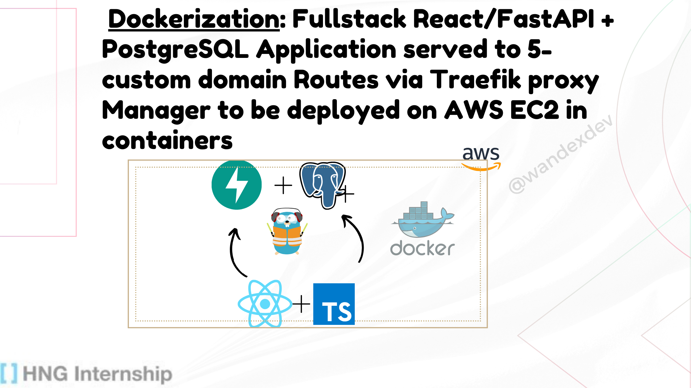
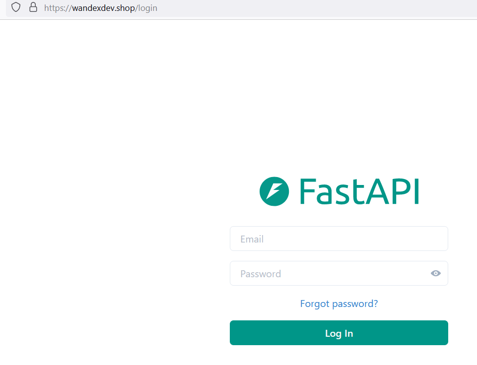
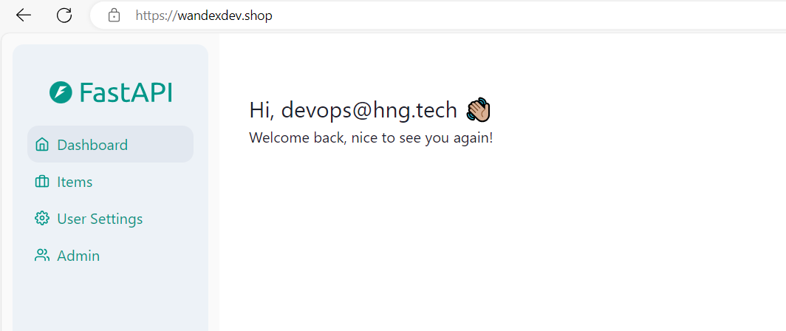

# Full-Stack FastAPI and React Template

Welcome to the Full-Stack FastAPI and React template repository. This repository serves as a demo application for interns, showcasing how to set up and run a full-stack application with a FastAPI backend and a ReactJS frontend using ChakraUI.

## Project Structure
The repository is organized into two main directories:
- **frontend**: Contains the ReactJS application. Get details - [Frontend README](./frontend/README.md)
- **backend**: Contains the FastAPI application and PostgreSQL database integration. Get details - [Backend README](./backend/README.md)

## Usage
#### For **Production** environment with a fullY DNS propaged domain name:
- Clone the repository via `git clone https://github.com/wandexdev/Dockerized-FullStack-ProxyManaged-Domain-Deployment/tree/main` to your terminal. 
- Locate the [root directory's environment variable file](.env) and fill as required below
```env
# Put your domain
DOMAIN=example.com

# Put your email
ACME_EMAIL=example@gmail.com
```
- Run `docker compose up -d`

#### For **Local/Development** environment without a domain name and SSL credentials:
- Clone the repository via `git clone https://github.com/wandexdev/Dockerized-FullStack-ProxyManaged-Domain-Deployment/tree/main` to your terminal.
- Locate the [root directory's dev environment variable file](.env.dev) and fill as required below
```env

```
- Run 

You should get a login and landing page similar to this after inputing login credentials


